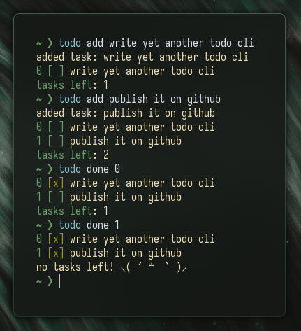

# todo cli

> [!TIP]
> Tasks are automatically removed after they have been displayed 5 times while completed

## Installation
1. `git clone https://github.com/Sophed/todo.git`
2. `cd todo`
3. `cargo build --release`

## Usage
- Add a task: `todo add <task>` — Aliases: `create`, `new`, `+`

- Remove a task: `todo remove <index>` — Aliases: `delete`, `del`, `-`

- Toggle a task: `todo done <index>` — Aliases: `do`, `x`, `toggle`

- Help menu: `todo help` — Aliases: `?`
