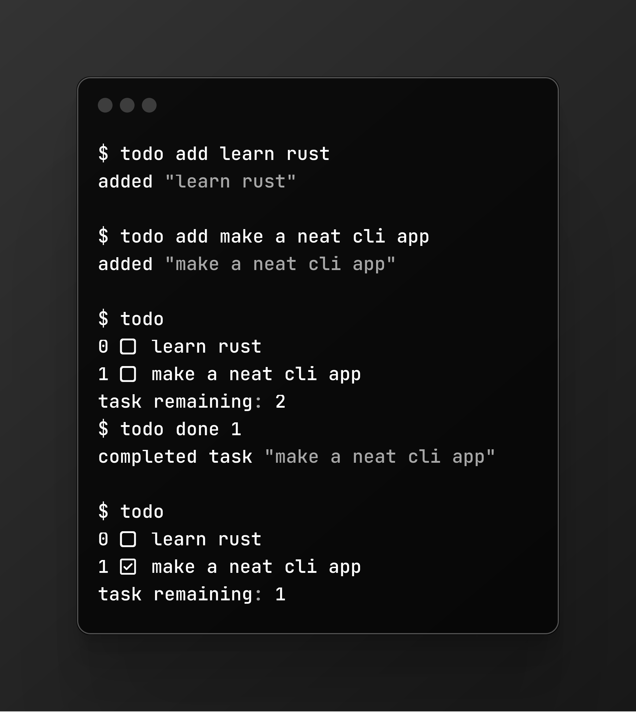

# todo-rs

## Installation
1. `git clone https://github.com/Sophed/todo-rs.git`
2. `cd todo-rs`
3. `cargo build --release`

## Usage
`todo add <task>`
`todo remove <task number>`
`todo check <task number>`
`todo uncheck <task number>`